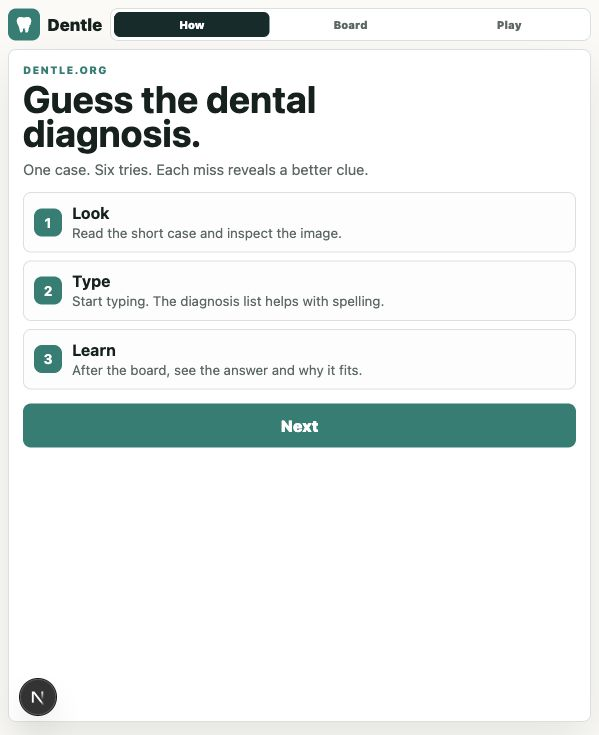
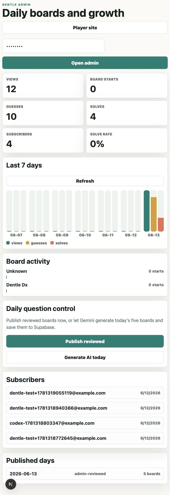

# Reddit Launch Post Draft

Suggested subreddits to check first:

- `r/DentalSchool`
- `r/Dentistry`
- `r/predental`
- school-specific dental student communities if allowed

Always read each subreddit rules before posting. Lead with feedback, not promotion.

## Title Options

1. I built a daily Wordle-style dental diagnosis game. Would dental students actually use this?
2. Feedback request: Dentle, a daily dental diagnosis guessing game for dental students
3. I’m testing a dental version of Wordle for diagnosis practice. Bad idea or worth continuing?

## Post

Hey everyone, I’m building a small project called **Dentle**.

It is basically a Wordle-style daily dental diagnosis game. Instead of guessing a word, you pick a board, read a short case, look at a clinical/radiograph clue image, and guess the diagnosis or treatment decision. Wrong guesses reveal more clues, and when you get it right it explains why the answer fits.

Screenshots:

- Home/how it works: `docs/screenshots/dentle-home.png`
- Board picker: `docs/screenshots/dentle-boards.png`
- Admin/dashboard side: `docs/screenshots/dentle-admin.png`

What it does right now:

- Five board types: diagnosis, radiograph, oral pathology, treatment planning, and emergencies
- Diagnosis autocomplete so spelling does not block the game
- Useful clue images instead of random dental stock photos
- Daily board storage through Supabase
- Admin dashboard with real usage/subscriber metrics
- Optional AI generation for new daily boards, with human review still recommended

Why I’m making it:

I saw medical Wordle-style games get attention from premed/medical/nursing students, and I wondered if dental students would want a quick daily practice format too. Dental school has a lot of pattern recognition: radiographs, lesions, emergency decisions, treatment planning, and differentials. A daily game might make that feel less like flashcards and more like a habit.

Questions:

1. Would you actually play something like this during dental school?
2. Which board type would be most useful: radiographs, oral pathology, endo/perio diagnosis, emergencies, or treatment planning?
3. Should this stay as a quick daily game, or would a searchable case bank / Anki-style mode be more useful?
4. Is AI-generated daily content acceptable if the cases are reviewed before publishing, or would that be a red flag?
5. What would make you subscribe for daily reminders?

My honest concern:

This could be a fun niche product, but it might also be too narrow unless it solves a real study problem. I’m trying to figure out whether to keep going, pivot it into a serious case bank, or make it a radiograph/pathology-only tool.

Open to blunt feedback.

## Should You Continue?

Yes, but validate it before overbuilding.

Best signs:

- Dental students ask for specific categories.
- People share scores or challenge classmates.
- Users come back for multiple days.
- Students submit corrections or ask for more cases.

Red flags:

- People think it is fun once but do not return.
- The cases feel too basic for dental students but too specialized for predental students.
- Image licensing/review takes too much time.
- AI cases need so much correction that automation does not save effort.

## Better Alternatives Or Pivots

1. Radiograph-only Dentle

This may be the strongest version because images are naturally diagnostic and dental students need repetition.

2. Oral pathology daily

High-yield, visual, and shareable. Also easier to make educational.

3. Dental emergency decision game

Good for boards and clinical readiness: hypoglycemia, syncope, avulsion, allergic reactions, local anesthetic toxicity.

4. Case bank plus daily mode

Daily game gets users in. Case bank keeps them studying.

5. Anki export

Let users save missed cases to Anki. This makes it more useful than a toy.

## Screenshot Files

